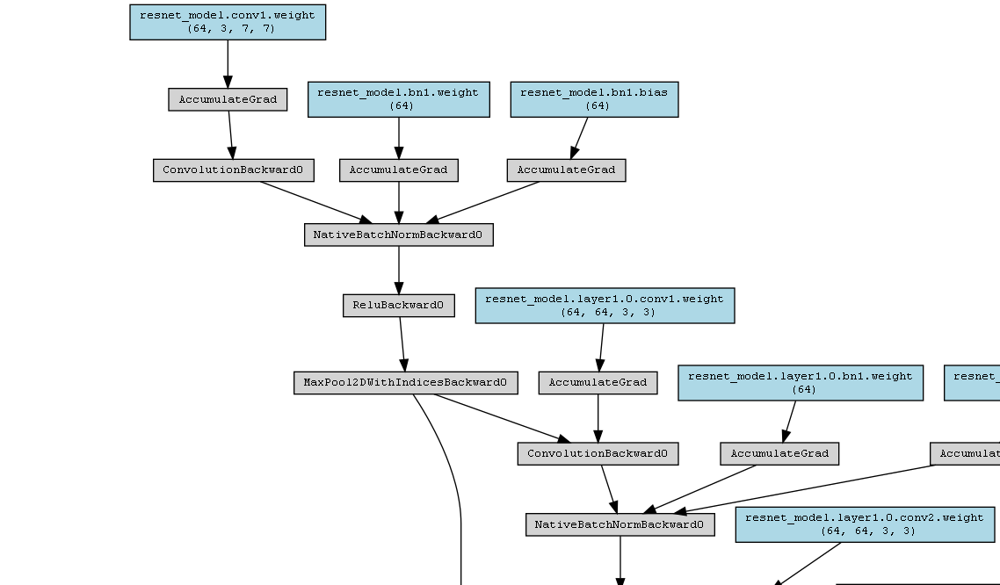
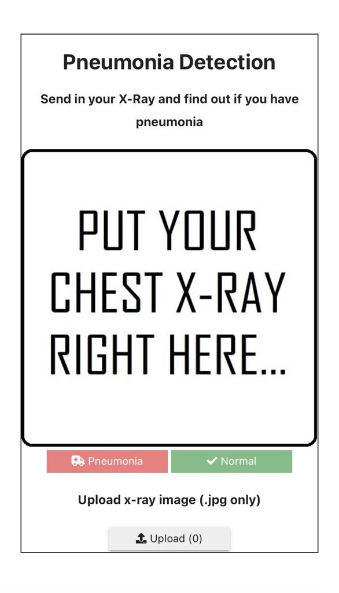
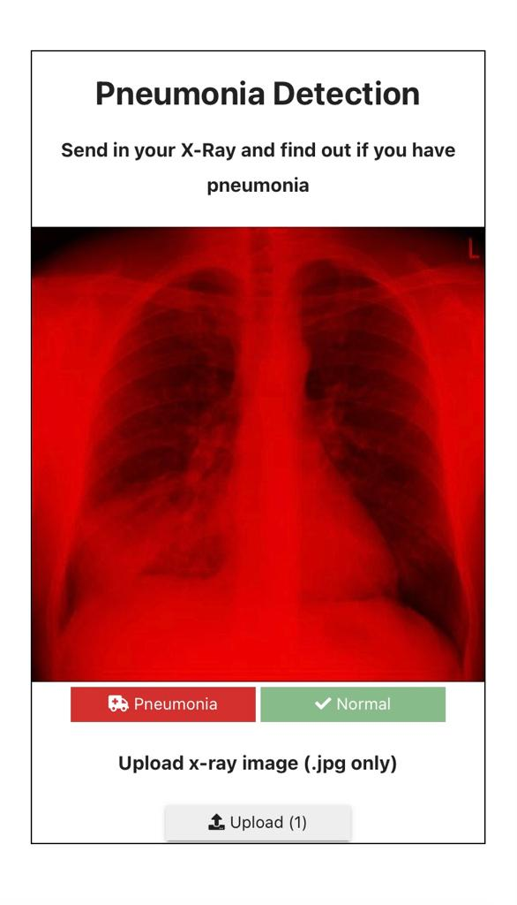

# Pneumonia-Detection

### Pneumonia

> Pneumonia is a form of acute respiratory infection that affects the lungs. The lungs are made up of small sacs called alveoli, which fill with air when a healthy person breathes. When an individual has pneumonia, the alveoli are filled with pus and fluid, which makes breathing painful and limits oxygen intake.

### Diagnosis 

> An X-ray helps your doctor look for signs of inflammation in your chest. If inflammation is present, the X-ray can also inform your doctor about its location and extent.

### Pneumonia-Detector

> Pneumonia-Detector attempts to automate methods to detect and classify pneumonia from medical x-ray images using a [Convolutional Neural Network](https://en.wikipedia.org/wiki/Convolutional_neural_network). It is able to detect correctly 88% of pneumonia cases but it is NOT in any way a substitute for consulting a professional medical examiner. 

# Model Architecture Plot

[Click to view full architecture](images/model_architecture.png)



# Built Using (v1)
 - [Python](https://python.org)
 - [PyTorch](https://pytorch.org)
 - [OpenCV](https://opencv.org)
 - [Kaggle Notebooks](https://www.kaggle.com)
 - [Scikit-Learn](https://scikit-learn.org)
 - [ipywidgets](https://ipywidgets.readthedocs.io/)
 - Others
 
 # Built Using (v2)
 - [Python](https://python.org)
 - [HuggingFace](https://huggingface.co/)
 - [Gradio](https://gradio.app/)

# Prerequisite and Installation (v1)
* [Python](https://python.org)
    ```
        python detect.py
    ```     
* [Voila](https://voila.readthedocs.io/en/stable/using.html)
    
# Project Structure

```
│   training.ipynb (v2)
│   inference.ipynb (v2)
│   detect-voila.ipynb (v1)
│   script.py (v1)
│   pneumonia-detection.ipynb (v1)
│
├───utils (v1)
│   ├──constants.py (v1)
│   ├──pneumonia_model.py (v1)
│   └───utils.py (v1)
│
└───weights
    └─── pneumonia_detector_model.pth (v1)
```

# Usage (v1)

> For coders: Use the 'diagnose' method in [script.py](script.py) either by importing or editing the script file itself. Pass an x-ray image (either a PIL.Image, torch.tensor, numpy.array or even a path to the image file) as argument to the function. 

> For non-coders: Visit this [Binder](https://mybinder.org/v2/gh/Daheer/Pneumonia-Detection/HEAD?urlpath=%2Fvoila%2Frender%2Fdetect-voila.ipynb) link, wait for it to render, sip some coffee as you wait :). 

# Usage (v2)

> Visit the Colab notebook by clicking [here](https://colab.research.google.com/drive/1Z5yRnuUNHr6pbnkdjDAYFLS4Q-vXUFxk)

# Demo (v1)

Visit [Binder](https://mybinder.org/v2/gh/Daheer/Pneumonia-Detection/HEAD?urlpath=%2Fvoila%2Frender%2Fdetect-voila.ipynb) to try it yourself.

Placeholder               |  Prediction
:-------------------------:|:-------------------------:
 |  

# Usage (v2)

> Visit the Colab notebook by clicking [here](https://colab.research.google.com/drive/1Z5yRnuUNHr6pbnkdjDAYFLS4Q-vXUFxk) and interact with the Gradio Interface

# References

- [Kaggle Chest X-Ray Pneumonia Dataset](https://www.kaggle.com/datasets/paultimothymooney/chest-xray-pneumonia)
- [World Health Organization Pneumonia Details](https://www.who.int/news-room/fact-sheets/detail/pneumonia)

# Contact

Dahir Ibrahim (Deedax Inc) - http://instagram.com/deedax_inc <br>
Email - suhayrid@gmail.com <br>
YouTube - https://www.youtube.com/@deedaxinc <br>
Twitter - https://twitter.com/DeedaxInc <br>
Project Link - https://github.com/Daheer/Pneumonia-Detection
