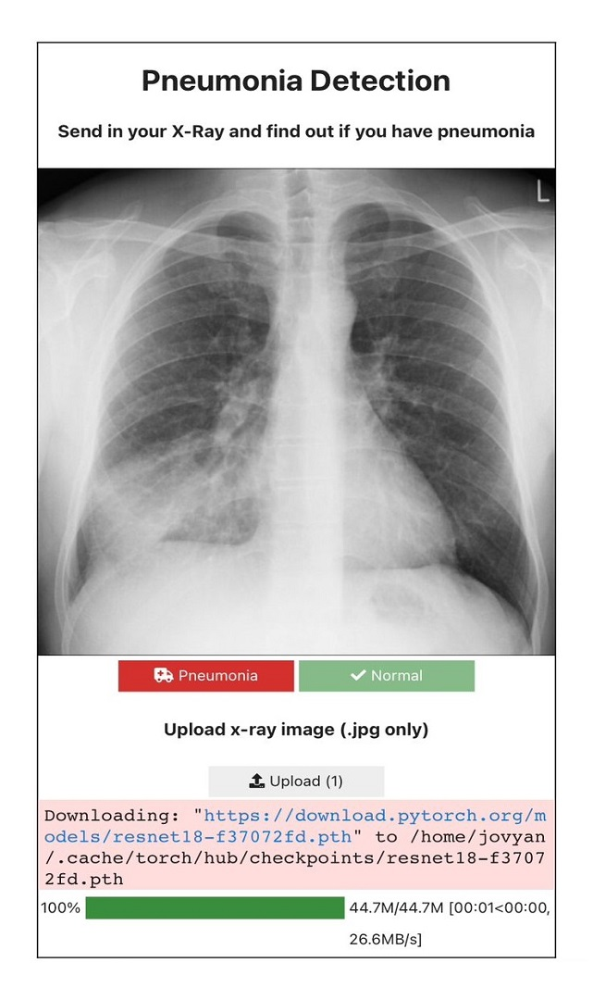

# Pneumonia-Detection

Definition of Pneumonia according to WHO
Diagnosis and Precaution

# Model Architecture Plot

[Click to view full architecture](images/model_architecture.png)


# Built Using
 - [Python](https://python.org)
 - [PyTorch](https://pytorch.org)
 - [OpenCV](https://opencv.org)
 - [Kaggle Notebooks](https://www.kaggle.com)
 - [Scikit-Learn](https://scikit-learn.org)
 - [ipywidgets](https://ipywidgets.readthedocs.io/)
 - Others

# Prerequisite and Installation
* [Python](https://python.org)
    ```
        python detect.py
    ```     
* [Voila](https://voila.readthedocs.io/en/stable/using.html)
    
# Project Structure

```
│   detect-voila.ipynb
│   detect.py
│   pneumonia-detection.ipynb 
│
├───pneumonia-detector-utils
│   ├──constants.py
│   ├──pneumonia_model.py
│   └───utils.py
│
└───weights
   └─── pneumonia_detector_model.pth
```

# Usage

> For coders: Use the 'diagnose' method in detect.py either by importing or editing the script file itself. Pass an x-ray image (either a PIL.Image, torch.tensor or numpy.array) as argument to the function. 

> For non-coders: Visit this [Binder](https://mybinder.org/v2/gh/Daheer/Pneumonia-Detection/HEAD?urlpath=%2Fvoila%2Frender%2Fdetect-voila.ipynb) link, wait for it to render, sip some coffee as you wait :). 


# Demo

Placeholder               |  Prediction
:-------------------------:|:-------------------------:
 |  

# References

- [Kaggle Chest X-Ray Pneumonia Dataset](https://www.kaggle.com/datasets/paultimothymooney/chest-xray-pneumonia)

# Contact

Dahir Ibrahim (Deedax Inc) - http://instagram.com/deedax_inc <br>
Email - suhayrid@gmail.com <br>
YouTube - https://www.youtube.com/channel/UCqvDiAJr2gRREn2tVtXFhvQ <br>
Project Link - https://github.com/Daheer/Pneumonia-Detection <br>
Twitter - https://twitter.com/DeedaxInc